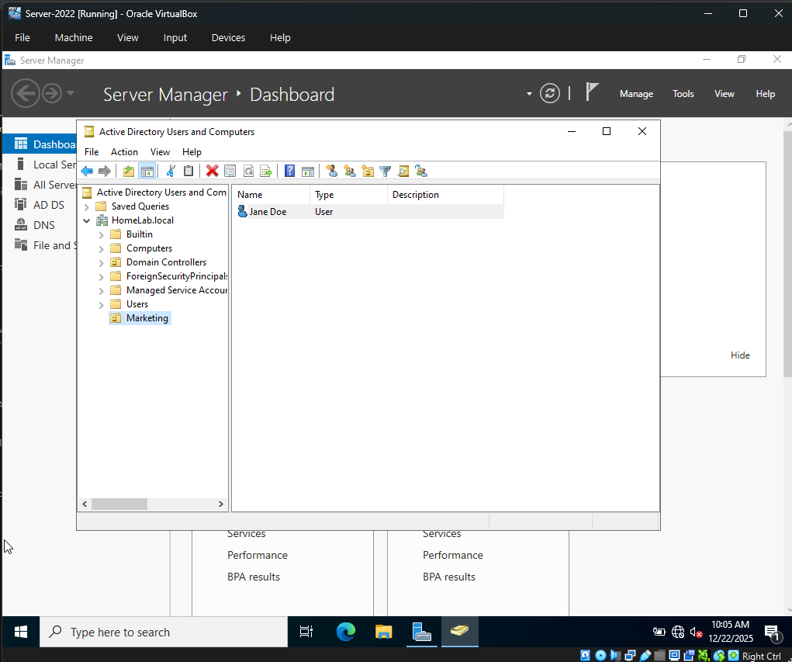
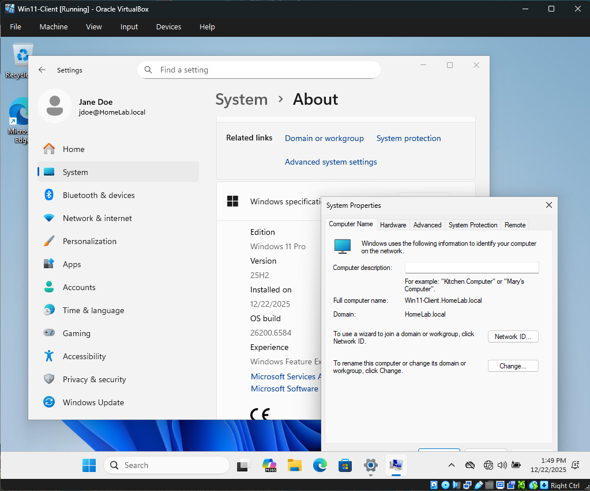

# Home-Lab-Projects
**Enterprise Lab: Active Directory, Windows Server 2022, and Windows 11.**
*Security-focused system administration and troubleshooting.*

---

# Windows Active Directory & Cybersecurity Home Lab
**Project Status:** Active | **Role:** Junior Systems Administrator / Cybersecurity Technician / Help Desk

## 🎯 Project Overview
This project involves the deployment of a fully functional Windows enterprise environment within a virtualized sandbox. The objective was to simulate real-world IT support scenarios, including server configuration, user lifecycle management, and advanced system recovery. This lab demonstrates my proficiency in the CompTIA A+ and Security+ domains.

---

## 🛠️ Technical Stack
* **Virtualization:** Oracle VirtualBox 7.2.4
* **Server OS:** Windows Server 2022 (Standard Desktop Experience)
* **Client OS:** Windows 11 Pro (Enterprise Simulation)
* **Networking:** Isolated Virtual Internal Network (`intnet`)
* **Address Space:** `172.16.0.0/24`

---

## 🏗️ Phase 1: Domain Controller Infrastructure
* **Deployment:** Provisioned a Windows Server 2022 instance with hardware tuning (vCPU/RAM optimization) for stable performance.
* **Active Directory (AD DS):** Configured a new forest (`HomeLab.local`) and promoted the server to Domain Controller.
* **DNS Configuration:** Established DNS roles to manage name resolution across the private network.
* **Networking:** Configured static IP addressing (`172.16.0.1`) and confirmed "loopback" DNS functionality.

---

## 👥 Phase 2: User Lifecycle & Permissions
* **Organizational Units:** Created a hierarchical OU structure (e.g., `Marketing`, `IT`, `Finance`) to mirror corporate environments.
* **User Provisioning:** Created department-specific users (e.g., `jdoe`) with standardized login conventions.
* **Security Policies:** Implemented password complexity requirements and practiced account lockout/unlock procedures.
* **Conflict Resolution:** Resolved "Grayed Out" checkbox conflicts in AD by identifying and remediating contradictions between "Password Never Expires" and "User Must Change Password" flags.

---

## 🛠️ Phase 3: Advanced Troubleshooting (The "Utilman Hack")
One of the most significant learning curves in this project involved a local administrative lockout on the Windows 11 client caused by an automated "Unattended Installation" script.

* **The Problem:** The Windows 11 client was locked into a "Standard User" profile without an option to elevate to Administrator, preventing the installation of VirtualBox Guest Additions and Domain Joining.
* **The Action:**
* 1. Booted into the **Windows Recovery Environment (WinRE)** via CLI.
  2. Identified the system drive mapping via `dir` commands.
  3. Performed a **System File Swap** by replacing the Accessibility utility (`utilman.exe`) with the Command Prompt (`cmd.exe`).
  4. Escalated privileges from the login screen to force the creation of a new Local Admin account (`LabAdmin`).
* **The Result:** Successfully regained administrative control, installed Guest Additions, and completed the Domain Join.

---

## 🔗 Phase 4: Network Integration (Domain Join)
* **Client Configuration:** Tuned Windows 11 networking to use the Server IP as the primary DNS resolver.
* **The "Handshake":** Successfully joined the Windows 11 workstation to `HomeLab.local`.
* **Verification:** Logged in as a standard domain user (`jdoe`) and verified connectivity using the `whoami` and `ipconfig /all` commands.

---

## 📸 Lab Evidence & Screenshots
*Documentation of the lab in action:*

1. **Server Dashboard:** 
2. **Active Directory Structure:** 
3. **Domain Join Success:** 
4. **CLI Verification:** 

---

## 🧠 Key Skills Demonstrated
* **Active Directory Management:** OU creation, User management, Password resets.
* **Server Administration:** DNS roles, Static IP configuration, DC Promotion.
* **OS Hardening & Recovery:** Command Line Interface (CLI), Registry manipulation, WinRE troubleshooting.
* **Virtualization:** Resource allocation, Internal Networking, Guest Addition optimization.
