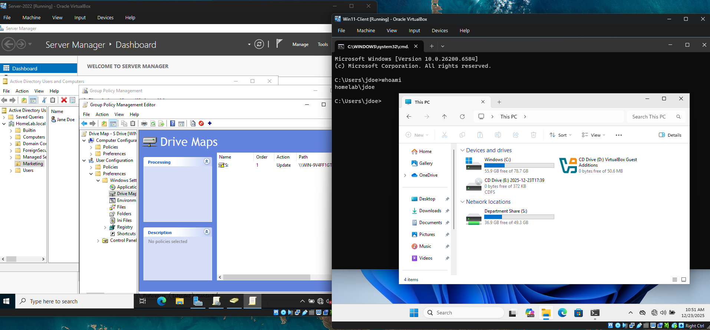
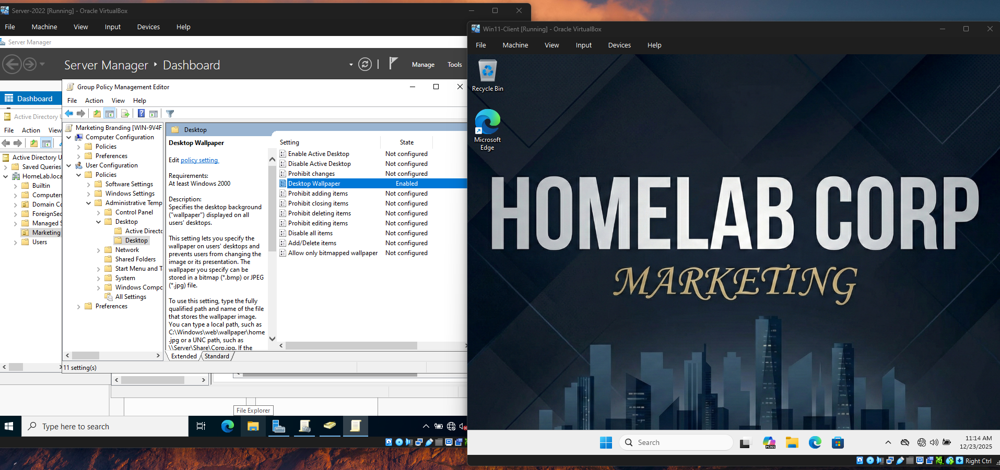
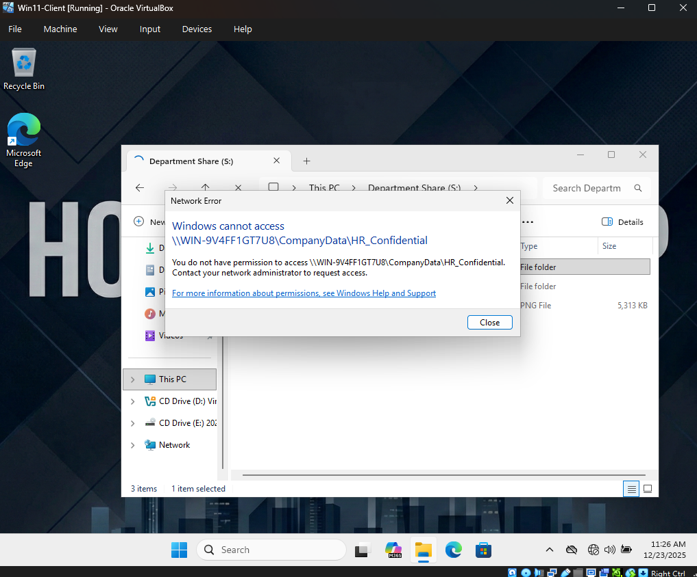
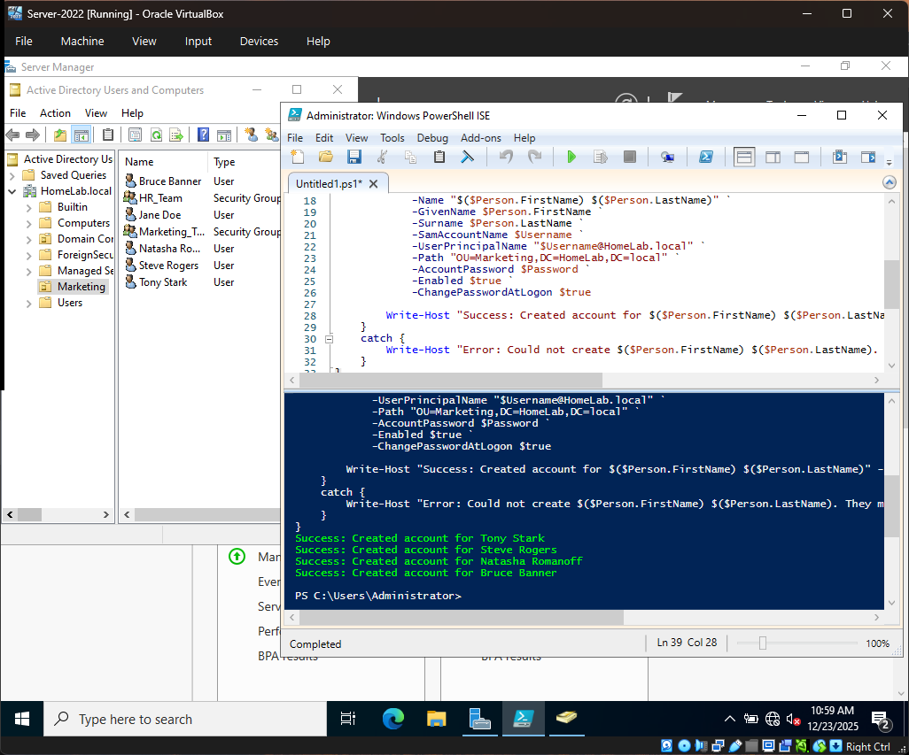

# Home-Lab-Projects
**Enterprise Lab: Active Directory, Windows Server 2022, and Windows 11.**
*Security-focused system administration, automation, and troubleshooting.*

---

# Windows Active Directory & Cybersecurity Home Lab
**Project Status:** Complete | **Role:** Junior Systems Administrator / Cybersecurity Technician

## 🎯 Project Overview
This project involves the deployment of a fully functional Windows enterprise environment within a virtualized sandbox. The objective was to simulate real-world IT support scenarios, moving beyond basic setup into advanced administration. Key achievements include **disaster recovery (WinRE)**, **Group Policy enforcement**, **ACL security hardening**, and **PowerShell automation** for bulk user provisioning.

---

## 🛠️ Technical Stack
* **Virtualization:** Oracle VirtualBox 7.2.4
* **Server OS:** Windows Server 2022 (Standard Desktop Experience)
* **Client OS:** Windows 11 Pro (Enterprise Simulation)
* **Networking:** Isolated Virtual Internal Network (`intnet` | `172.16.0.0/24`)
* **Scripting:** PowerShell & Batch

---

## 🏗️ Phase 1: Infrastructure & Networking
* **Domain Controller:** Configured a new forest (`HomeLab.local`) and promoted a Windows Server 2022 instance to Domain Controller.
* **DNS Services:** established internal DNS resolution to allow client-server communication without external internet reliance.
* **Networking:** Implemented static IP addressing (`172.16.0.1`) and verified connectivity between isolated virtual machines.

---

## 👥 Phase 2: User Lifecycle & Permissions
* **Organizational Units:** Designed a hierarchical OU structure (Marketing, IT, HR) to mirror corporate environments.
* **Security Policies:** Implemented password complexity requirements and account lockout thresholds to simulate real-world security standards.
* **Troubleshooting:** Resolved AD conflicts between "Password Never Expires" and "User Must Change Password" settings.

---

## 🛠️ Phase 3: Advanced Troubleshooting (The "Utilman Hack")
*Demonstrating deep OS-level recovery skills.*

* **The Incident:** An automated "Unattended Installation" script locked the Windows 11 client into a standard user profile with no administrative access, blocking the domain join.
* **The Fix:**
    1. Booted into the **Windows Recovery Environment (WinRE)**.
    2. Performed a **System File Swap** (`utilman.exe` ↔ `cmd.exe`) via Command Line.
    3. Escalated privileges from the login screen to create a local `LabAdmin` account.
    4. Successfully installed Guest Additions and joined the domain.

---

## 📜 Phase 4: Group Policy & Security Hardening
*Demonstrating centralized management capabilities.*

* **Drive Mapping GPO:** Created a Group Policy Object to automatically map a network share (`S:`) for Marketing users upon login.
* **Corporate Branding GPO:** Enforced a standardized desktop background across client machines using UNC paths, preventing users from changing it.
* **Least Privilege Access (ACLs):** Configured NTFS permissions on the file server. Verified that Marketing users could access `Marketing_Docs` but were blocked from `HR_Confidential` (Resulting in "Access Denied").

---

## ⚡ Phase 5: PowerShell Automation
*Demonstrating "Infrastructure as Code" efficiency.*

* **The Challenge:** Manually creating dozens of users is inefficient and error-prone.
* **The Solution:** Developed a PowerShell script using `Import-Csv` and `New-ADUser` loops.
* **The Result:** Automatically provisioned 50 user accounts from a raw text file, assigning them to the correct OUs and setting initial passwords in under 2 seconds.

---

## 📸 Lab Evidence & Screenshots
*Visual documentation of the configured environment:*

1.  **Server Dashboard:** 
2.  **Active Directory Structure:** 
3.  **Domain Join Success:** 
4.  **CLI Verification:** 
5.  **GPO Drive Map Success:** 
6.  **GPO Wallpaper Enforcement:** 
7.  **Security Permissions (ACLs):** 
8.  **Automated User Provisioning:** 

---

## 🧠 Key Skills Demonstrated
* **Active Directory (AD DS):** User Management, OUs, Security Groups.
* **Group Policy (GPO):** Drive Maps, Desktop Restrictions, Policy Enforcement.
* **Network Security:** NTFS Permissions, ACLs, Least Privilege.
* **Automation:** PowerShell Scripting, CSV Data Imports, Loops.
* **Disaster Recovery:** WinRE, System File Manipulation, Registry Editing.
